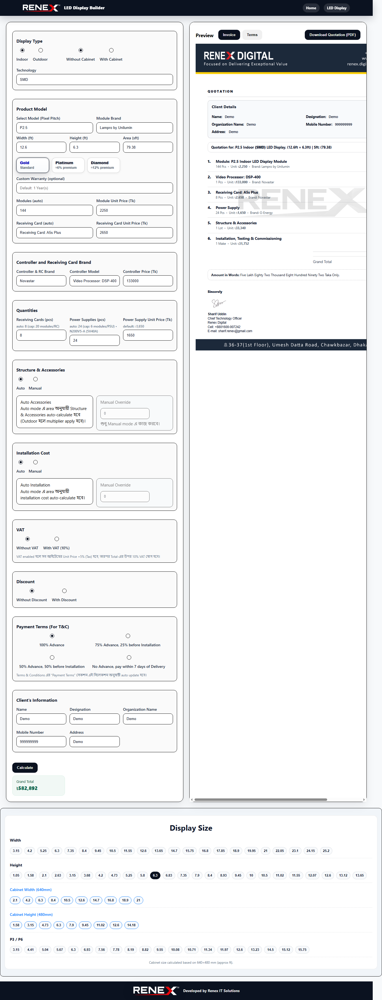

# Renex LED Display Quotation Suite

### Turn complex LED projects into clear, confident proposals—in minutes.

Premium **web-based quoting** for LED display sales: configure the stack, apply commercial terms, see **totals in Bangladesh Taka (BDT)**, and deliver a **polished, brand-true PDF** your buyers can trust.

[**Mugnee IT Solution**](https://mugneeit.com) · *Custom software for serious B2B teams*

 

 

**Live workspace preview** — configuration, commercial controls, BDT grand total, and on-brand quotation layout in one place.

---

> **Executive snapshot:** A single, guided experience replaces scattered spreadsheets and one-off documents—so every quote is **accurate**, **consistent**, and **presentation-ready** for your customer.

---

## Why leaders invest in a solution like this

| Outcome | What it means for your business |
| :--- | :--- |
| **Faster wins** | Shorter path from discovery call to a defensible number—without sacrificing rigor. |
| **Fewer costly mistakes** | Rules and structure live in the tool, not in someone’s memory or a fragile sheet. |
| **Brand you can stand behind** | Customers receive the same high-standard document every time—no “homemade” PDFs. |
| **Scale without chaos** | Partners and branches quote the same way, with less training and less rework. |

---

## What you get

**A client-grade quoting desk** built around how LED projects are actually sold—from module choice through controllers, structure, and commercial terms—then straight to a **two-page A4 PDF** (quotation + terms) that looks as serious as your brand.

- **Clarity under pressure** — Indoor/outdoor paths, technology options, and tiered offerings presented in a flow your team can follow on a live call or async.
- **Hardware, structured** — Modules, receiving cards, power, cabinets, and leading control/processing lines captured as line items your estimators recognize.
- **Sizing that matches reality** — Area-driven logic and practical presets so accessories and installation align with the footprint you’re quoting.
- **Commercial control** — VAT-related options, discounts, installation, and accessories—automatic or manual, aligned to **your** policy.
- **Preview before you promise** — Invoice-style layout plus terms, so what you see is what your customer gets.
- **One decisive export** — Branded PDF output with professional finishing (including watermarking where required)—ready to email, print, or archive.

---

## Built for these organizations

| You are… | This helps you… |
| :--- | :--- |
| **An LED vendor or integrator** | Standardize pricing and quoting across teams, branches, and partners. |
| **A Pro AV or signage reseller** | Answer RFQs faster—with totals you can explain and documents you’re proud to attach. |
| **A technical sales or estimating lead** | Keep configuration, rules, and outputs in **one** system instead of three tabs and a template folder. |

Ideal when you sell **fine-pitch indoor**, **high-brightness outdoor**, and **full video-wall packages**—where **precision** and **perception** both decide the deal.

---

## From inputs to a customer-ready PDF

1. **Open** the quoting experience in the browser—no separate design stack required.  
2. **Define** the project: environment, technology, pitch, and tier—where your catalog supports it.  
3. **Build** the bill of materials: quantities that reflect the real stack you intend to deliver.  
4. **Align** area and sizing so downstream line items (accessories, installation) track the job size.  
5. **Set** commercial terms the way your finance and sales leadership expect.  
6. **Calculate** to refresh line items, taxes/discounts, and the **grand total in BDT**—with human-readable amounts where it matters.  
7. **Review** invoice and terms on-screen—then **export** the **Renex-branded PDF** for the customer or internal approval.

---

## Platform & engineering quality

Delivered as a **modern browser application**—fast to roll out, easy to access, and built to last:

| Dimension | Approach |
| :--- | :--- |
| **Experience** | Responsive, component-based interface—built for daily sales use, not a one-off demo. |
| **Design system** | Tailwind-driven styling for a clean, consistent layout that scales with new screens. |
| **Documents** | High-fidelity PDF generation—so what you preview matches what you print and send. |
| **Reliability** | Automated UI testing patterns suitable for ongoing releases and regression confidence |

*This repository is a **showcase** of outcomes and visuals; implementation assets are not published here by design.*

---

## Visual walkthrough

The hero image above is **`screencapture-localhost-3000-2026-04-13-16_16_37.png`**—a real view of the **core workflow**: inputs, totals in **BDT**, and the **on-screen quotation preview** buyers recognize as “enterprise-grade.”

Optional additions you may publish later:

| File (suggested) | Purpose |
| :--- | :--- |
| `screenshots/02-configuration-form.png` | Tighter focus on configuration |
| `screenshots/03-display-sizing.png` | Display size / area presets |
| `screenshots/04-invoice-preview.png` | Full invoice preview |
| `screenshots/05-terms-preview.png` | Terms & conditions view |
| `screenshots/06-pdf-export.png` | Export moment or sanitized PDF pages |

---

## How the system is organized (high level)

- **Experience layer** — The screens your team touches: guided inputs, previews, and brand-aligned layouts.  
- **Rules & calculation layer** — The logic that turns selections into line items, taxes, discounts, and final totals in BDT.  
- **Document layer** — The path that assembles **multi-page PDFs** suitable for email, print, and record-keeping.  
- **Brand & assets** — Logos, templates, watermarking, and optional product PDFs that complete the customer package.

The result: speed **without** sacrificing control—and documents that hold up in front of a CFO, a consultant, or a procurement team.

---

## Confidentiality & source access

**Production source code, pricing data, and internal configuration remain private**—by design—to protect **security**, **intellectual property**, and **client confidentiality**.  

If you are evaluating a similar initiative—**CPQ**, **quoting portals**, **PDF automation**, or a vertical configurator—**[contact Mugnee IT Solution](https://mugneeit.com)** to discuss scope, hosting, and delivery under an appropriate engagement or NDA.

---

### Mugnee IT Solution

**We design and ship custom software and integrations for businesses that need outcomes—not experiments.**

[**mugneeit.com**](https://mugneeit.com)

 

**Ready for a quoting experience your team and customers respect?**  
[**Start a conversation →**](https://mugneeit.com)

 

*Portfolio showcase — documentation and visuals only.*

