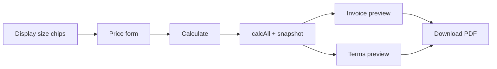

<div align="center">

# Renex LED Display Builder

**A client-facing web app to configure LED display projects, calculate BDT pricing, preview branded quotations, and export a two-page PDF (invoice + terms).**

[](https://react.dev/)
[](https://create-react-app.dev/)
[](https://tailwindcss.com/)
[](https://nodejs.org/)

[Live site context](https://mugnee.com/) · [LED Display category](https://www.mugnee.com/product-category/led-display/) · [Repository](https://github.com/mugnee-it/Renex-Calculator)

</div>

---

## Table of contents

| | |
| :--- | :--- |
| [Overview](#overview) | What this product is and who it is for |
| [Key features](#key-features) | Calculator, preview, PDF, datasheets |
| [Tech stack](#tech-stack) | Libraries and tooling |
| [How it works](#how-it-works) | User flow and architecture |
| [Project structure](#project-structure) | Folders and responsibilities |
| [Getting started](#getting-started) | Install, run, test, build |
| [Configuration](#configuration) | Env files and assets |
| [PDF export](#pdf-export) | How quotations are generated |
| [Pricing logic](#pricing-logic-summary) | High-level rules (see code for detail) |
| [Credits](#credits) | Branding and development |

---

## Overview

| | |
| :--- | :--- |
| **Product name** | Renex **LED Display Builder** (quotation calculator) |
| **Purpose** | Sales engineers and partners can pick display technology, pitch, controllers, area, VAT/discount options, and payment terms—then get a **Grand Total in BDT**, a **print-ready preview**, and **`Renex_Quotation.pdf`**. |
| **Brand** | Renex IT Solutions (header/footer, invoice template, watermark). |
| **Audience** | Internal sales / dealers who need **consistent pricing** and **professional PDF output** without a separate design tool. |

> **Note:** Module catalogue prices and business rules live in `src/data/models.js` and `src/lib/calc.js`. Update those when commercial terms change.

---

## Key features

<details>
<summary><strong>Click to expand feature list</strong></summary>

| Area | Details |
| :--- | :--- |
| **Configuration** | Indoor / outdoor, **SMD**, **GOB**, **COB** (where applicable), pitch selection, **Gold / Platinum / Diamond** tiers (warranty display varies by tier). |
| **Hardware lines** | Module qty, receiving cards, power supplies, **HD / Novastar** controllers & video processors, **640×480 mm cabinet** quantities and pricing. |
| **Area & sizing** | Square footage input plus **Display Size** chip picker (width/height presets, P3/P6 grid, cabinet-based sizes) to push values into the form. |
| **Commercial** | Accessories (auto by area or manual), installation (auto by area or manual %/fixed), **VAT** (with configurable markup + rate), **discount** in BDT. |
| **Output** | **Grand Total** summary, **Invoice** and **Terms & Conditions** tabs, amount in **words** (crore/lakh style), auto **quotation reference** (`RDQ-…`). |
| **PDF** | One click → **two A4 pages**: page 1 invoice, page 2 terms; uses **html2canvas** + **pdf-lib**, company **template strips** and **watermark**. |
| **Datasheets** | Bundled **PDF brochures** under `public/Renex Product data sheet/`; export flow can resolve paths for module catalogue attachments (see `PDFButton.jsx`). |

</details>

---

## Tech stack

| Layer | Choice |
| :--- | :--- |
| **UI** | React 19, Create React App (`react-scripts` 5) |
| **Styling** | Tailwind CSS 3 + PostCSS + custom CSS (invoice layout, topbar, display-size chips) |
| **Math & copy** | `src/lib/calc.js` — BDT formatting, amount in words, `calcAll`, reference IDs |
| **Catalogue data** | `src/data/models.js` — model groups, controller list, PSU base price |
| **PDF / canvas** | `html2canvas`, `pdf-lib` (multi-page stitch), `jspdf` present in dependencies |
| **Tests** | React Testing Library (`npm test`) |

---

## How it works



1. User fills **PriceForm** and clicks **Calculate**.  
2. **`calcAll`** returns line totals, VAT, discount, payable; form state becomes **`snapshot`** for the invoice/terms components.  
3. **Preview** uses on-screen A4 styling; **hidden duplicate DOM** (`pdf-page-1`, `pdf-page-2`) feeds **PDFButton** for pixel-accurate export.  
4. **DisplaySize** section sends picked width/height into the form via ref callback.

---

## Project structure

```text
RenexCalculator/
├── public/
│   ├── logo.png / logo-site.*     # Brand assets
│   ├── Renex_Invoice.png          # A4 template strips (header/footer)
│   ├── renex_watermark.png        # Watermark source
│   ├── signature.png
│   └── Renex Product data sheet/  # Module, controller, PSU PDFs (linked from export logic)
├── src/
│   ├── components/
│   │   ├── PriceForm.jsx          # Main form + calculate
│   │   ├── Invoice.jsx            # Quotation layout
│   │   ├── TermsPage.jsx          # Terms & conditions
│   │   ├── PDFButton.jsx          # html2canvas + pdf-lib export
│   │   └── DisplaySize.jsx      # Quick size chips
│   ├── data/
│   │   └── models.js              # MODEL_GROUPS, CONTROLLERS, PSU price
│   ├── lib/
│   │   ├── calc.js                # Pricing engine + BDT helpers
│   │   └── watermark.js           # Transparent watermark data URL
│   ├── App.js                     # Shell: header, preview, PDF targets, footer
│   ├── index.js
│   └── App.test.js
├── tailwind.config.js
├── postcss.config.js
├── package.json
└── README.md
```

---

## Getting started

### Prerequisites

- **Node.js** 18+ recommended (LTS)
- **npm** (ships with Node)

### Install

```bash
git clone https://github.com/mugnee-it/Renex-Calculator.git
cd Renex-Calculator
npm install
```

### Run (development)

```bash
npm start
```

Opens [http://localhost:3000](http://localhost:3000) with hot reload.

### Test

```bash
npm test
```

### Production build

```bash
npm run build
```

Output: `build/` — deploy that folder to any static host (Netlify, Vercel, S3, IIS, nginx, etc.).

---

## Configuration

| Topic | Notes |
| :--- | :--- |
| **Secrets** | No API keys required for core calculator. Keep `.env.*` files local; they are gitignored by CRA defaults where applicable. |
| **Paths** | Static PDF paths under `public/` are referenced from export helpers; renaming folders requires updating `PDFButton.jsx` maps. |
| **Robots** | `public/robots.txt` present for web deployment tuning. |

---

## PDF export

| Step | Implementation |
| :--- | :--- |
| Capture | **html2canvas** on `#pdf-page-1` and `#pdf-page-2` (off-screen, fixed A4 width in px) |
| Assembly | **pdf-lib** embeds raster pages at A4 size (`595.28 × 841.89` pt) |
| Branding | Template strips from `Renex_Invoice.png`, optional processed **watermark** from `makeTransparentWatermarkDataUrl()` |
| Filename | Default download: **`Renex_Quotation.pdf`** |

---

## Pricing logic (summary)

| Component | Behaviour (short) |
| :--- | :--- |
| **Units** | Integer-ish quantities; money values rounded **up** to whole BDT where applied (`ceil`). |
| **Tiers** | Gold / Platinum / Diamond select per-module unit bands from `MODEL_GROUPS`. |
| **VAT mode** | When enabled, a **tax markup** factor applies to effective unit prices and certain add-ons before **VAT amount** on subtotal + install path (see `calcAll`). |
| **Accessories** | Auto: by **sq ft** thresholds; outdoor applies a multiplier; manual override available. |
| **Installation** | Auto by area or manual (fixed or % of subtotal for install base). |
| **Discount** | Optional BDT discount capped so payable never goes negative. |

For exact formulas, read **`src/lib/calc.js`** and form wiring in **`src/components/PriceForm.jsx`**.

---

## Screenshot placeholder

<div align="center">

| Add your hero image here |
| :---: |
| `` |

*Create a `docs/` folder, drop a wide screenshot, and uncomment or add the line above for a rich GitHub readme header.*

</div>

---

## Credits

| | |
| :--- | :--- |
| **Developed by** | Renex IT Solutions |
| **Product context** | [mugnee.com](https://mugnee.com/) |
| **Repository** | [github.com/mugnee-it/Renex-Calculator](https://github.com/mugnee-it/Renex-Calculator) |

---

## License

No `LICENSE` file is bundled in this repository. Add one (e.g. MIT for open source, or a proprietary notice) if you redistribute or open-source the codebase.

---

<div align="center">

**Built for accurate LED quotations and a consistent Renex-branded PDF experience.**

</div>
